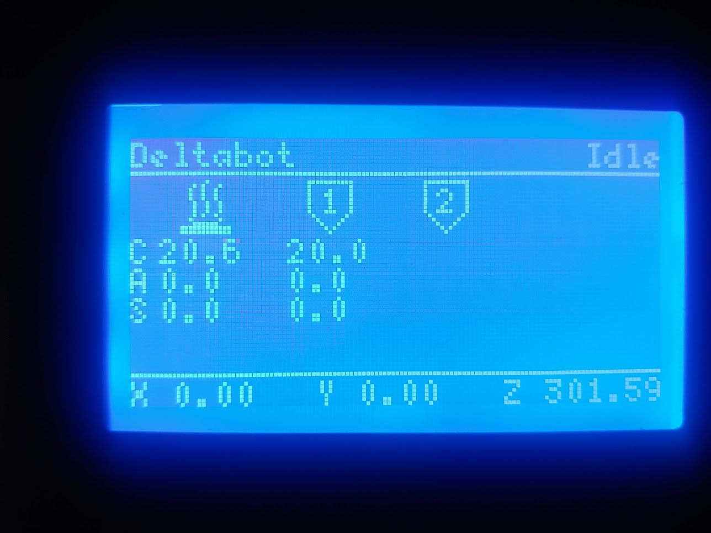
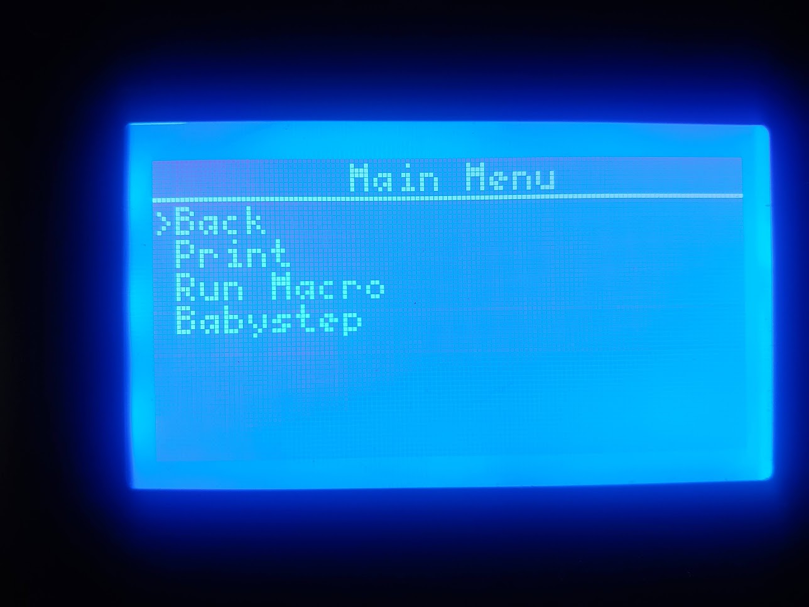

# DisplayRRF
Software to communicate with ReprapFirmware and drive a RRD LCD. This project was developed for on an Arduino Mini Pro but should work on most Arduino compatible boards.
# Required libraries
* u8g2
* Encoder
* PinChangeInterrupt
# Pin assignements
Can be changed in Pins.h
Arduino Mini Pro|EXP1|Signal
---------|-----|-----|
RAW|10|+5VDC
GND|9|GND
13|5|SCLK
11|3|MOSI
10|4|CS
5|1|BEEP
8|2|ENC_SW
		
Arduino Mini Pro|EXP2|Signal
---------|-----|-----|
2|5|ENC_A
3|3|ENC_B
A0|8|RESET_EXT
# RRF Config
Add the following to your config.g file
    M575 P1 S0 B57600
# Pictures

